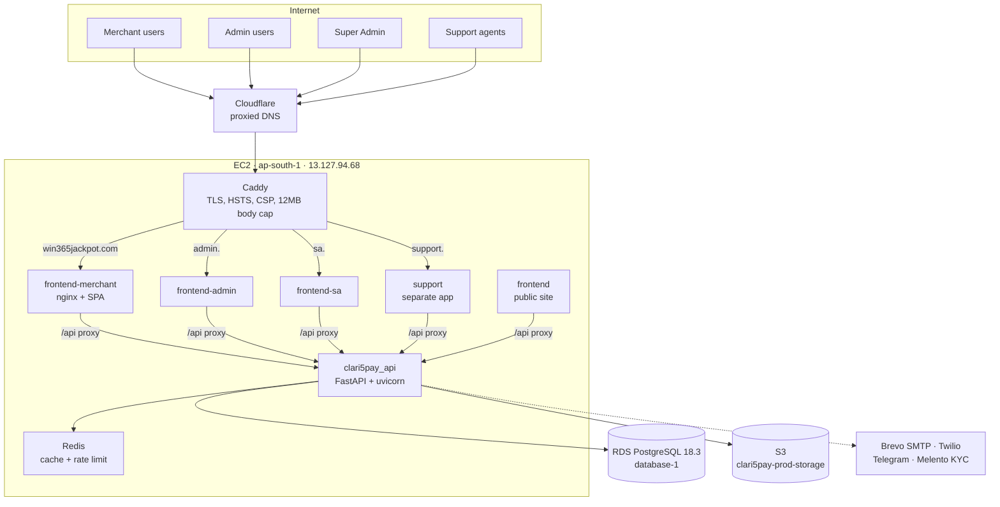
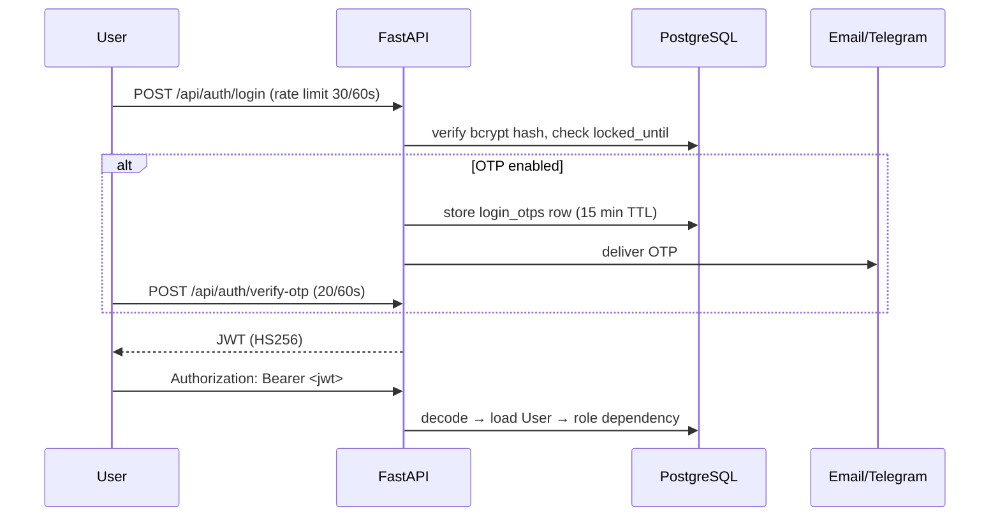
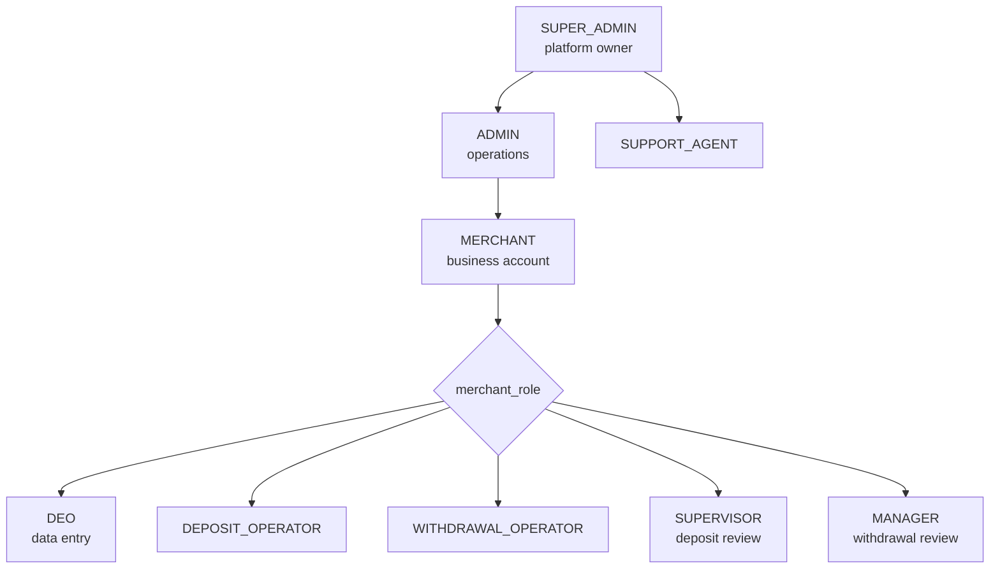
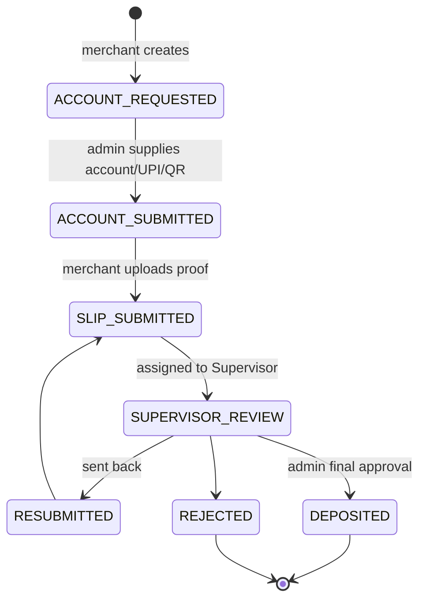
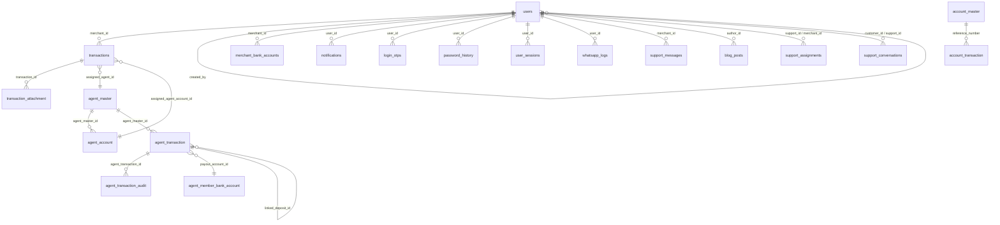

# Clari5Pay — Architecture & Database Reference

**Audience:** engineers joining the platform.
**Method:** every statement below was verified against the source tree and the live production
database on 2026-07-19. Anything that could not be verified is marked **[UNVERIFIED]** rather than
inferred.

**Scope:** Part 1 (Architecture) and Part 2 (Database). Performance, security, code quality,
business flows, deployment and roadmap are separate passes.

---

# Part 1 — Architecture

## 1.1 System at a glance

| Dimension | Measured |
|---|---|
| Backend | 15,864 LOC Python, 25 route modules, **197 endpoints**, 7 services |
| Frontend | 16,708 LOC TypeScript/React across 46 source files |
| Support frontend | separate app, 7 source files |
| Database tables (models) | 28 on `main`, 25 on `production` |
| Database tables (prod, live) | **27** — includes 2 orphans (§2.9) |
| Automated tests | **1 file** (`backend/tests/test_storage_migration.py`) |
| CI/CD | **none** — no `.github/workflows` |

### Runtime topology



Each portal is the **same codebase built per role** (different `VITE_*` build args), served by its
own nginx container, which proxies `/api` to the shared backend. Caddy is the only internet-facing
process and terminates TLS.

Verified in `Caddyfile`, `docker-compose.prod.yml`, `docker-compose.https.yml`.

## 1.2 Backend architecture

```
backend/app/
├── api/routes/     25 modules, 197 endpoints
├── core/           config, security, deps, cache, ratelimit, uploads, storage, email, passwords
├── db/             session, migrate, seed
├── models/         models.py — all 28 tables in ONE file (999 lines)
├── schemas/        schemas.py — Pydantic request/response (462 lines)
└── services/       kyc, membership, presence, support_routing, tg_notify, whatsapp
```

**Layering is three-tier, not four.** There is no repository layer — routes construct SQLAlchemy
queries directly. `services/` holds integrations (KYC, WhatsApp, Telegram) and two domain helpers
(`membership`, `support_routing`), not a general service layer. Business logic lives in the route
modules, which is why `transactions.py` is 2,281 lines.

Async throughout: FastAPI + `asyncpg` via SQLAlchemy 2.0 async ORM.

### Largest modules (maintainability pressure)

| File | Lines |
|---|---|
| `api/routes/transactions.py` | 2,281 |
| `api/routes/agent_txns.py` | 1,920 |
| `models/models.py` | 999 |
| `api/routes/kyc.py` | 835 |
| `services/whatsapp.py` | 667 |

## 1.3 API architecture

197 endpoints across 24 URL prefixes, all under `/api`:

| Domain | Prefixes |
|---|---|
| Core financial | `/api/transactions`, `/api/accounts`, `/api/admin-upis`, `/api/merchant-bank-accounts` |
| Agent (isolated) | `/api/agent-txns`, `/api/agent-transactions`, `/api/agents`, `/api/agent-accounts`, `/api/agent-dashboard` |
| Identity | `/api/auth`, `/api/users`, `/api/active-users` |
| Risk & audit | `/api/risk`, `/api/audit-logs`, `/api/system-logs` |
| Support | `/api/support`, `/api/support-management` |
| Notifications | `/api/notifications`, `/api/whatsapp`, `/api/telegram` |
| Content | `/api/news`, `/api/blogs` |
| Other | `/api/kyc`, `/api/ai`, `/api/demo` |

Convention: JSON in, JSON out; camelCase in payloads, snake_case in the database, translated in
hand-written serializers (e.g. `_t()` at `transactions.py:549`). **No OpenAPI-driven client
generation** — the frontend has hand-written types in `frontend/src/types/index.ts`.

## 1.4 Authentication & authorization



**Verified mechanics**

- Passwords: bcrypt via `passlib` (`core/security.py:11,33`), with a policy check (`:15`) and
  `password_history` to block reuse
- Brute force: `users.failed_attempts` + `users.locked_until`
- JWT: HS256, `SECRET_KEY` from env
- **Token lifetime is role-dependent** — `ACCESS_TOKEN_EXPIRE_MINUTES = 1440` (24h) for
  merchant/support, but `ADMIN_TOKEN_EXPIRE_DAYS = 3650` (**10 years**) for Admin and Super Admin
  (`core/config.py:10,14`). Documented as deliberate; flagged for the security pass.
- Rate limiting: Redis-backed on login/OTP/reset (`core/ratelimit.py`); **fails open** on Redis
  error (`ratelimit.py:54`)
- `user_sessions` tracks active sessions; `/api/active-users` exposes presence

**Authorization** is FastAPI dependencies in `core/deps.py` — 13 guards, one per role or role
group: `get_current_admin`, `get_current_super_admin`, `get_current_merchant`,
`get_current_support`, `get_transactions_overseer`, `get_current_supervisor`,
`get_current_manager`, `get_current_kyc_user`, `get_current_agent_manager`,
`get_current_agent_operator`. Merchant sub-roles are checked with `_is_merchant_role`
(`deps.py:80`) and `agent_role_in` (`:137`).

There is **no central policy table** — authorization is per-endpoint dependency selection. Correct
but easy to get wrong on a new endpoint; a coverage audit belongs in the security pass.

## 1.5 Role hierarchy



Two-level model: `UserRole` enum (`SUPER_ADMIN`, `ADMIN`, `MERCHANT`, `SUPPORT_AGENT`) at
`models.py:12`, plus `users.merchant_role` free-text sub-role (`:89`) carrying `DEO`,
`DEPOSIT_OPERATOR`, `WITHDRAWAL_OPERATOR`, `SUPERVISOR`, `MANAGER`.

**Note:** `merchant_role` is `String(32)`, not an enum — no database-level constraint on valid
values.

## 1.6 Portals

| Portal | Domain | Container | Audience |
|---|---|---|---|
| Merchant | `win365jackpot.com` | `frontend-merchant` | merchant staff by sub-role |
| Admin | `admin.win365jackpot.com` | `frontend-admin` | operations |
| Super Admin | `sa.win365jackpot.com` | `frontend-sa` | platform owner |
| Support | `support.win365jackpot.com` | `support` | support agents (separate app) |
| Public | (root build) | `frontend` | marketing/blog |

Merchant, Admin and SA are one React codebase built three times; Support is a distinct app
(`support-frontend/`).

## 1.7 Transaction flows

`TxStatus` (`models.py:35`) has 15 values spanning two generations — a legacy set
(`PENDING`/`APPROVED`/`COMPLETED`) and the current workflow set. Both are live; legacy rows retain
old statuses.

### Deposit



### Withdrawal / Settlement

Withdrawals run the same chain gated by **Manager** rather than Supervisor
(`MANAGER_REVIEW`), completing at `COMPLETED` with a payout leg. Settlements follow the
withdrawal shape and additionally require a UTR **and** a proof file before completion
(`transactions.py:1819`).

**Balance formula** — the canonical expansion, at `transactions.py:1320`:

```
deposit    → + amount × (1 − pay_in_rate)
withdrawal → − amount × (1 + pay_out_rate)
settlement → − amount × (1 + pay_out_rate)
```

`compute_global_summary` (`transactions.py:277`) is documented as the single source of truth for
every Admin/SA dashboard figure.

## 1.8 Agent module

**Two separate subsystems share the word "agent".** This is the most common source of confusion:

1. **Agent Management** (`/api/agents`, `/api/agent-accounts`, `/api/agent-transactions`) —
   assignment-based; routes an existing merchant transaction through an agent via
   `transactions.assigned_agent_id`.
2. **Isolated Agent Ledger** (`/api/agent-txns`, 1,920 lines) — its own tables
   (`agent_transaction`, `agent_transaction_audit`, `agent_member_bank_account`), **no foreign key
   to `transactions`**, and explicitly documented as never affecting merchant balances, treasury,
   risk or reports (`models.py` `AgentTransaction` docstring).

**Deployment status:** the isolated ledger exists on `main` only. The `production` branch does not
contain those tables, and they are **absent from the production database** (verified §2.8).

## 1.9 Supporting subsystems

**Risk** (`/api/risk`, 564 lines) — `users.risk` (LOW/MEDIUM/HIGH/CRITICAL) plus per-transaction
`risk_analysis` and `high_risk` flags.

**Notifications** — in-app `notifications` table, mirrored to WhatsApp (Twilio/Meta,
`services/whatsapp.py`), SMS, and Telegram (`services/tg_notify.py`). Delivery is
provider-agnostic and inert when unconfigured. Demo is Telegram-only.

**Audit** — two tables: `audit_logs` (business actions, 4,738 rows) and `system_logs` (technical,
2,680 rows), plus `agent_transaction_audit` for the isolated ledger.

**Reports** — `_build_report_payload` in `transactions.py`; three agent reports in the isolated
module. Aggregation is SQL-side since commit `14477a26`.

**Integrations** — Brevo SMTP (OTP email), Twilio (WhatsApp/SMS), Telegram Bot API, Melento.ai
(Aadhaar/PAN/Passport/OCR/DigiLocker), Razorpay IFSC lookup (client-side, allow-listed in CSP),
Anthropic API (`/api/ai`).

## 1.10 Storage layer

Migrated 2026-07-19. `core/storage.py` (301 lines) is provider-agnostic:

- `STORAGE_BACKEND` = `db` (base64 inline, legacy) or `s3`
- Columns hold `storage://<key>`; keys are content-addressed
  (`uploads/<field>/<sha2>/<sha16>.<ext>`), making the backfill idempotent
- Objects are private; access only via short-lived presigned URLs minted **after** endpoint
  authorization
- No `DeleteObject` permission anywhere
- `_client()` pins the regional endpoint and SigV4 — without both, presigned URLs fail while
  uploads appear healthy

Production: 109 objects, 34 MB. See `OBJECT_STORAGE_RUNBOOK.md`.

## 1.11 Database layer

- **RDS PostgreSQL 18.3**, `database-1`, ap-south-1, SSL required
- SQLAlchemy 2.0 async + asyncpg; pool configurable (`DB_POOL_SIZE` 20, `DB_MAX_OVERFLOW` 30,
  `DB_POOL_TIMEOUT` 10) — **per uvicorn worker**
- **No Alembic.** Schema comes from `Base.metadata.create_all` plus a hand-rolled idempotent
  reconciler at `db/migrate.py` (`ADD COLUMN IF NOT EXISTS` list). Additive-only by convention:
  columns are never dropped
- Redis: response caching (`core/cache.py`) and rate limiting only — not a queue; **there are no
  background workers**

## 1.12 AWS infrastructure

| Resource | Value |
|---|---|
| Prod EC2 | `i-036dc6cd44f85ed26` · 13.127.94.68 · role `instanceRole` |
| Demo EC2 | `i-0f03a901278863559` · 13.207.207.217 · role `clari5pay-demo-instanceRole` |
| Prod RDS | `database-1` · PostgreSQL 18.3 · 20 GB gp2 · encrypted · 7-day retention |
| Demo RDS | `clari5pay-demo` · 20 GB gp3 |
| Prod bucket | `clari5pay-prod-storage` — private, versioned, SSE-S3 |
| Demo bucket | `clari5pay-demo-storage` |
| IAM | list/get/put on one prefix; **no delete** |
| DNS/CDN | Cloudflare (proxied) |

Roles were separated on 2026-07-19; before that both environments shared `instanceRole`.

---

# Part 2 — Database Architecture

## 2.1 ER diagram (core financial + identity)



## 2.2 Live production sizing (2026-07-19)

| Table | Rows | Total | Indexes |
|---|---:|---:|---:|
| `transactions` | 78 | 2,032 kB | 48 kB |
| `whatsapp_logs` | **3,183** | 2,000 kB | 288 kB |
| `news` | 14 | 1,256 kB | 32 kB |
| `audit_logs` | **4,738** | 1,016 kB | 256 kB |
| `system_logs` | **2,680** | 584 kB | 160 kB |
| `notifications` | 1,911 | 488 kB | 192 kB |
| `users` | 30 | 304 kB | 64 kB |
| `transaction_attachment` | 170 | 200 kB | 112 kB |
| `user_sessions` | 327 | 176 kB | 64 kB |
| `login_otps` | 514 | 160 kB | 80 kB |
| `account_transaction` | 68 | 104 kB | 80 kB |
| *(16 further tables)* | <120 each | ≤104 kB | — |
| **Database total** | | **18 MB** | |

**The highest-growth tables are log tables, not financial ones.** `audit_logs`, `whatsapp_logs`
and `system_logs` together hold **10,601 of ~14,000 rows** — 76% of all rows in the platform.

## 2.3 Table catalogue — financial & identity (critical)

### `users` — 30 rows
Every human and business account across all four roles.
**PK** `id`. **FK** `created_by → users.id` (self-referencing: which admin created a merchant).
**Unique** `username`, `email`, `merchant_code`. **Indexed** `id`, `username`, `email`,
`merchant_code`, `support_code`.
Carries auth (`hashed_password`, `failed_attempts`, `locked_until`), merchant config
(`pay_in`/`pay_out`/`settlement` ref prefixes and three fee rates), support-member fields, and
`avatar` (base64 data URL, **not deferred**).
**Growth:** slow, bounded by staff and merchant count. **Owner:** Super Admin.
**Note:** one table serves four distinct role shapes; ~30 of its columns are role-specific and NULL
for most rows.

### `transactions` — 78 rows · financial system of record
Every deposit, withdrawal and settlement.
**PK** `id`. **Unique** `ref`. **FK** `merchant_id → users.id`,
`assigned_agent_id → agent_master.id`, `assigned_agent_account_id → agent_account.id`.
**Indexed** `id`, `ref` only.
Four image columns (`merchant_proof`, `merchant_proofs`, `admin_proof`, `admin_bank_image`) are
`deferred=True` and now hold `storage://` references. `has_admin_bank_image` is a
`column_property` (`models.py:225`) giving a cheap presence flag without loading the blob.
**Growth:** the primary financial table; grows with business volume.
**Indexing gap:** no index on `merchant_id`, `status`, `type` or `tx_date` — every dashboard,
report and balance query filters on these. At 78 rows this is invisible; it will not stay so.
**Owner:** merchant creates, Admin/Supervisor/Manager transition.

### `account_master` / `account_transaction` — 17 / 68 rows
Platform-side settlement accounts and their ledger.
**FK** `account_transaction → account_master.reference_number` — **the only FK in the schema that
targets a non-`id` column**. **Indexed** `reference_number`, `member_id`,
`transaction_reference_number`.

### `merchant_bank_accounts` — 59 rows
Payout accounts per merchant member. **FK** `merchant_id → users.id`. **Indexed** `merchant_id`,
`member_id`. Holds bank account numbers and IFSC — **PII, unencrypted at column level** (encrypted
at rest by RDS).

### `admin_upis` — 0 rows
Admin UPI IDs for deposit collection. **Unique** `account_ref`. Empty in production.

### `transaction_attachment` — 170 rows *(added 2026-07-19)*
One row per uploaded file now in object storage.
**PK** `id`. **FK** `transaction_id → transactions.id`.
**Unique** `(transaction_id, field, object_key)`. **Indexed** `transaction_id`, `object_key`,
`checksum`.
Deliberately **off the read path** — `_t()` is synchronous and cannot query, so the reference lives
on the transaction row. Metadata/audit only.
**Growth:** ~2.2 rows per transaction with images.

## 2.4 Audit & log tables (highest growth)

| Table | Rows | Purpose | Retention |
|---|---:|---|---|
| `audit_logs` | 4,738 | business actions; indexed on `business` | **none configured** |
| `system_logs` | 2,680 | technical events | **none configured** |
| `whatsapp_logs` | 3,183 | message delivery; indexed `user_id`, `message_id` | **none configured** |
| `notifications` | 1,911 | in-app inbox; indexed `user_id` | **none configured** |
| `login_otps` | 514 | OTPs, 15-min TTL | **rows are not purged** |
| `user_sessions` | 327 | session/presence; indexed `user_id`, `active` | **none configured** |
| `agent_transaction_audit` | — | isolated ledger audit | not in production |

**No retention policy exists on any of these.** `login_otps` is the clearest case: 514 rows persist
for credentials that expired within 15 minutes. These are the natural first candidates for
archival or partitioning — see §2.10.

## 2.5 Support subsystem

`support_messages` (111), `support_conversations` (4), `support_assignments` (17),
`support_config` (1).
`support_assignments` carries the schema's **only composite unique constraint**:
`UniqueConstraint("support_id", "merchant_id", name="uq_support_merchant")` (`models.py:462`) —
enforcing one assignment per support/merchant pair.

## 2.6 Content & configuration

| Table | Rows | Note |
|---|---:|---|
| `news` | 14 | **1,256 kB — 97% TOAST**: base64 `image`, not deferred |
| `blog_posts` | 12 | `cover_image` base64, not deferred |
| `app_settings` | 2 | key/value platform config |
| `support_config` | 1 | support module config |
| `kyc_verification_history` | 0 | KYC audit; holds `aadhaar_photo` (PII, base64) |

`news` is the second-largest table by TOAST share despite holding 14 rows — the same pattern that
caused the July outage, at a volume where it is currently harmless.

## 2.7 Agent tables

`agent_master`, `agent_account`, `agent_assignment_history` exist in production and are **empty**.
`agent_transaction`, `agent_transaction_audit`, `agent_member_bank_account` exist **only on
`main`** and are absent from the production database.

`agent_transaction` is notable for `linked_deposit_id → agent_transaction.id` — a self-referencing
FK linking a withdrawal back to the deposit whose agent it inherited.

## 2.8 Relationship cardinalities

**One-to-many (the dominant pattern — 22 of 23 FKs)**
`users → transactions`, `users → notifications/login_otps/password_history/user_sessions/
whatsapp_logs/merchant_bank_accounts`, `transactions → transaction_attachment`,
`account_master → account_transaction`, `agent_master → agent_account/agent_transaction`,
`agent_transaction → agent_transaction_audit`.

**Self-referencing one-to-many**
`users.created_by → users.id` (admin → merchants they created);
`agent_transaction.linked_deposit_id → agent_transaction.id`.

**Many-to-one from the financial table**
`transactions.assigned_agent_id`, `assigned_agent_account_id` — optional agent routing.

**Many-to-many** — **none exist as join tables.** `support_assignments` is the closest
(support ↔ merchant) but carries its own attributes and a uniqueness rule, so it is a
first-class entity rather than a pure join.

**One-to-one** — none.

## 2.9 Orphan tables ⚠️

Two tables exist in the **production database** but are defined in **no model on either branch**:

| Table | Rows | Size |
|---|---:|---:|
| `blog_categories` | 7 | 64 kB |
| `cyber_complaints` | 0 | 56 kB |

Since the schema is created by `create_all`, these must be remnants of removed models or manual
DDL. They are not maintained, not backed up separately, and not referenced by any code path.
**[UNVERIFIED]** — their origin could not be established from the current tree; git history would
be needed.

## 2.10 Classification

**Financial (highest integrity requirement)**
`transactions`, `account_master`, `account_transaction`, `merchant_bank_accounts`, `admin_upis`,
`transaction_attachment` — plus `agent_transaction` when deployed.

**Critical (platform stops without them)**
`users`, `app_settings`, `login_otps`, `user_sessions`.

**Audit (append-only, regulatory)**
`audit_logs`, `system_logs`, `agent_transaction_audit`, `password_history`.

**Configuration**
`app_settings`, `support_config`, `admin_upis`.

**High-growth / partition candidates**
`audit_logs`, `system_logs`, `whatsapp_logs`, `notifications` — 76% of all rows, none with
retention. Partitioning by month, or archival to cold storage, is the natural next step. Not urgent
at 18 MB total.

## 2.11 Verified database findings

1. **`transactions` has only two indexes** (`id`, `ref`) despite being filtered by `merchant_id`,
   `status`, `type` and `tx_date` throughout. The highest-value schema change available.
2. **No retention on any log table** — they already hold 76% of rows.
3. **Two orphan tables** in production.
4. **Base64 remains in `news.image`, `blog_posts.cover_image`, `users.avatar`,
   `kyc_verification_history.aadhaar_photo`** and the agent image columns — none deferred. Same
   pattern as the July outage, currently at safe volume.
5. **`merchant_role` is unconstrained text**, not an enum.
6. **No Alembic** — schema drift between branches is real and observable (25 vs 28 models).
7. **`account_transaction` FKs to a non-PK column**, the only such case.

---

## Verification notes

**Verified:** all table names, row counts, sizes and index sizes (live production query); FK and
index declarations, constraints, role enums, endpoint counts, file sizes, config values (source
inspection); AWS resource identifiers (API calls).

**[UNVERIFIED]:** origin of the orphan tables; whether every declared index physically exists in
production (declarations were read from models, sizes from `pg_indexes_size`, but a
column-by-column reconciliation was not performed); frontend runtime behaviour; actual query plans
under load.

**Not covered here:** performance, security, code quality, business flows, deployment, roadmap.
