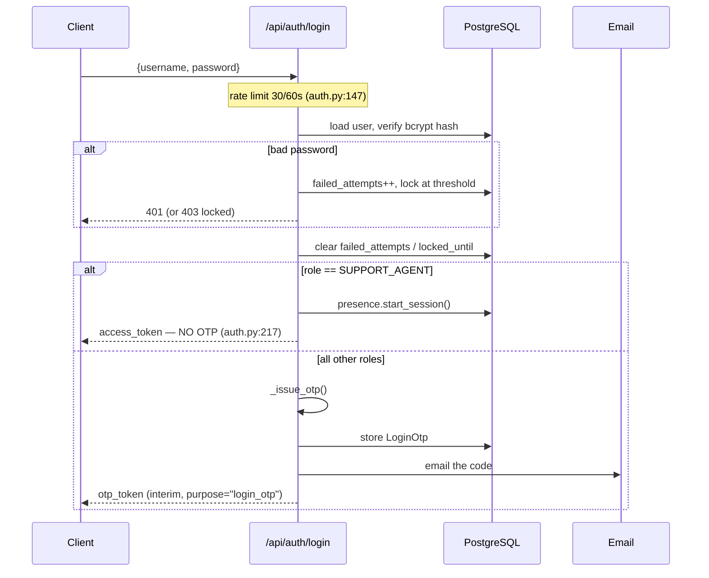
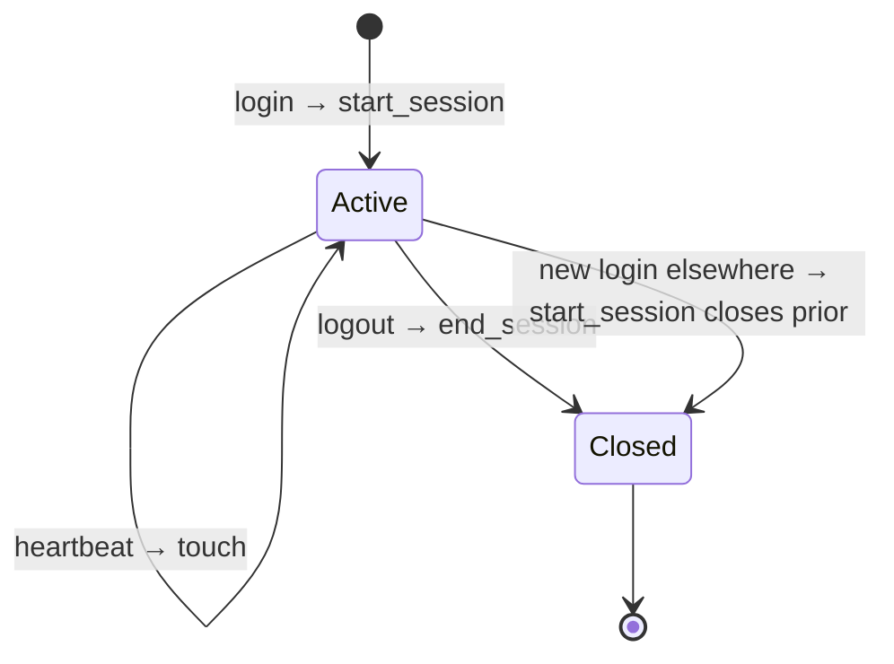

# Authentication & Session Architecture — Design Review

**Purpose:** choose a long-term solution for SEC-002 (admin tokens valid ten years, no revocation).
**Status:** design only. Nothing implemented.
**Method:** every statement about current behaviour is traced to code. Design projections are
labelled as estimates.

---

# 1. Current architecture

## 1.1 Login flow



**Verified:** `auth.py:147` (login), `:217` (support bypass), `:236` (`return await _issue_otp(...)`).
OTP is unconditional for Super Admin, Admin and Merchant — the `otp_enabled` setting is never
consulted (see `SECURITY_REVIEW.md` SEC-001b).

## 1.2 OTP flow

An interim JWT carries `{"sub", "purpose": "login_otp"}` with a lifetime of
`OTP_EXPIRE_MINUTES + 5` (`auth.py:93`). `POST /verify-otp` (rate limited 20/60s) validates the
code against `login_otps`, then issues the real session token via `_issue_session_token` and calls
`presence.start_session` (`:342`).

`purpose` is the only thing separating an interim OTP token from a session token — a session token
has no `purpose` claim at all.

## 1.3 JWT creation

```python
def create_access_token(data: dict, expires_delta=None) -> str:      # security.py:37
    to_encode = data.copy()
    expire = datetime.utcnow() + (expires_delta or timedelta(minutes=ACCESS_TOKEN_EXPIRE_MINUTES))
    to_encode.update({"exp": expire})
    return jwt.encode(to_encode, SECRET_KEY, algorithm=HS256)
```

**Session token claims are `sub` and `exp`. Nothing else.** No `jti`, no session id, no issued-at,
no role, no version. This is the single most important fact for the options below: **there is
currently no way to identify an individual token.**

Lifetime is role-based (`auth.py:39`):

```python
NO_TIMEOUT_ROLES = (UserRole.ADMIN, UserRole.SUPER_ADMIN)          # :36
expires = timedelta(days=ADMIN_TOKEN_EXPIRE_DAYS) if user.role in NO_TIMEOUT_ROLES else None
```

| Role | Lifetime |
|---|---|
| Super Admin, Admin | **3650 days (10 years)** |
| Merchant, Support Agent | 1440 minutes (24h) |

Four issuance points: session (`:44`), interim OTP (`:93`), support direct-login (`:218`),
password-reset confirmation (`:422`).

## 1.4 Token validation — the SEC-002 defect

```python
async def get_current_user(token, db) -> User:                      # deps.py:12
    payload = decode_token(token)                  # signature + exp only
    if payload is None: raise 401
    user_id = payload.get("sub")
    if user_id is None: raise 401
    user = await db.execute(select(User).where(User.id == int(user_id)))
    if user is None or not user.active: raise 401
    return user
```

Three checks: signature, expiry, `user.active`. **`user_sessions` is never consulted.** One
`SELECT users WHERE id = ?` per authenticated request — so a database round-trip already happens
on every request. That matters for the cost analysis: Option A adds a query to a path that is
already querying.

## 1.5 Logout flow

```python
"""... Access tokens here are stateless JWTs, so they are not server-side revoked —
the client clears its own token/cookies/storage. ..."""                # auth.py:275
```

Logout writes audit rows and calls `presence.end_session`. **The token remains valid.** A client
that "logs out" but retains the string can continue using it — for a decade, if admin.

Verified absent across `backend/app`: `jti`, denylist, blacklist, `token_version`, revoke.

## 1.6 `user_sessions` usage

```python
class UserSession(Base):                                            # models.py
    """Login-session presence tracking for the Active Users feature. One row per login;
    the newest active row is a user's current session. Online = an active session with a
    recent last_activity heartbeat. Stores ONLY session metadata — never tokens or passwords."""
    id, user_id (FK, indexed), login_at, last_activity_at,
    logout_at, active (indexed), ip_address, user_agent
```

**Writers**

| Call | Site | Effect |
|---|---|---|
| `start_session` | `auth.py:224` (support login), `:342` (post-OTP) | **Closes all prior active sessions**, opens one |
| `end_session` | `auth.py:288` (logout), `support_management.py:440` | Marks active sessions closed |
| `touch` | `active_users.py:47` (heartbeat) | Bumps `last_activity_at` |

**Readers** — presence display only:

| Site | Feature |
|---|---|
| `active_users.py:68,75,80` | Active Users dashboard |
| `support.py:433,436` | merchant online indicator |
| `support_management.py:110,168` | support member availability |

**Nothing reads `user_sessions` for authorization.**

## 1.7 Session lifecycle and two critical properties



**Property 1 — single active session per user.** `start_session` sets `active=False` on *all* the
user's active rows before inserting. Logging in on a second device closes the first row. Today
that is cosmetic (the first device keeps working, since nothing checks). **Under Option A it
becomes a hard logout** — a behavioural change, not just a security fix.

**Property 2 — presence failures are swallowed.**

```python
except Exception:  # presence must never block authentication
    pass
```

Every presence function is wrapped this way (`presence.py:81,93,107`). A failed `start_session`
today costs an inaccurate dashboard. If authentication depended on that row existing, the same
swallowed failure would **lock the user out**. Any design that makes auth depend on
`user_sessions` must remove this swallow — or accept silent lockouts.

## 1.8 What is *not* invalidated today

| Event | Existing tokens |
|---|---|
| Logout | **stay valid** |
| Password change / reset | **stay valid** — `set_password` (`passwords.py:38`) touches only `hashed_password` and `password_history` |
| Login elsewhere | stay valid |
| Account disabled | **revoked** — the `user.active` check catches this |
| `SECRET_KEY` rotation | all tokens everywhere die |

Account deactivation and secret rotation are the only two working revocation paths.

---

# 2. Why `user_sessions` exists

It was built for the **Active Users feature** — presence, not security. The docstring says so, and
every reader is a dashboard.

- **Purpose:** session *tracking* (who is online, from where, on what device)
- **Not auditing** — that is `audit_logs` / `system_logs`
- **Not revocation** — nothing consults it on the authenticated path

It is nonetheless a strong foundation for revocation: it already records one row per login,
indexed on `user_id` and `active`, already closed on logout, and already populated in production
(327 rows). What it lacks is any link between a row and a *token*.

---

# 3. Options

## Option A — Session lookup on every authenticated request

**Architecture.** `get_current_user` additionally requires an active `user_sessions` row for the
user; requests fail 401 without one.

```python
sess = await db.execute(
    select(UserSession).where(UserSession.user_id == user.id, UserSession.active == True)
)
if sess.first() is None:
    raise credentials_exception
```

| | |
|---|---|
| **Advantages** | No schema change. No token-format change. Reuses a populated, indexed table. Logout becomes real immediately. Existing tokens keep working (rows exist). Smallest diff of any option. |
| **Disadvantages** | **Single-session-per-user becomes enforced** (Property 1) — a second device logs the first out. Auth now depends on presence writes that currently fail silently (Property 2). Revokes *per user*, not per token: cannot kill one stolen token while keeping others. |
| **Performance** | +1 indexed query per request. Index exists on `user_id` and `active`. Adds to a path already doing one `SELECT users`. **Estimate: +0.3–1 ms per request**, roughly doubling auth DB work. Not measured. |
| **Operational** | A stale/missing row logs users out. The swallowed exception must be removed, so presence failures become login failures. |
| **Schema** | None. |
| **API** | None. |
| **Deploy risk** | **Medium-high.** Any user without an active row is logged out on deploy. 327 rows exist but coverage is unverified. |
| **Rollback** | Trivial — revert the query. |

## Option B — JWT `jti` with denylist

**Architecture.** Add a unique `jti` claim per token; on logout/revocation insert it into a denylist
(Redis with TTL = token lifetime, or a table); `get_current_user` rejects listed `jti`s.

| | |
|---|---|
| **Advantages** | True per-token revocation — kill one stolen token, keep others. Multi-device works naturally. Standard, well-understood pattern. |
| **Disadvantages** | **A 10-year TTL makes the denylist effectively permanent** — entries must outlive the token. Redis is currently cache + rate limit only and **fails open** (`ratelimit.py:54`); a fail-open denylist revokes nothing. A durable denylist means a new table plus cleanup. Only revokes tokens you know about — useless against a token stolen silently. |
| **Performance** | +1 Redis GET (~0.1–0.5 ms) or +1 indexed query. Cheapest if Redis-backed. |
| **Operational** | New store to monitor, size, and back up. Redis loss = revocations forgotten. |
| **Schema** | Denylist table (if durable). |
| **API** | None — but **all existing tokens lack `jti`**, so a policy is needed: reject them (mass logout) or grandfather them (SEC-002 persists for a decade). |
| **Deploy risk** | Medium — turns on the `jti` requirement. |
| **Rollback** | Easy — stop checking. |

## Option C — `token_version` on the user record

**Architecture.** `users.token_version INTEGER DEFAULT 0`; tokens carry the value at issuance;
`get_current_user` rejects mismatches. Incrementing the column invalidates every token for that
user.

| | |
|---|---|
| **Advantages** | **No extra query** — `users` is already loaded, so the check is free. Naturally handles "log out everywhere", password change, and admin forced logout. Simple to reason about. Durable (a DB column, no Redis dependency). |
| **Disadvantages** | All-or-nothing per user — cannot revoke one device. Requires a claim, so existing tokens need a policy. Adds a column to the hottest table. |
| **Performance** | **Zero additional cost.** The comparison uses data already fetched. Best of all options. |
| **Operational** | Minimal. One integer. |
| **Schema** | One nullable/defaulted column — fits the additive-only convention (`migrate.py`). |
| **API** | None externally; the claim is internal. |
| **Deploy risk** | **Low.** Treat a missing claim as version 0 and existing tokens keep working. |
| **Rollback** | Trivial — stop comparing. The column is harmless. |

## Option D — Short-lived access tokens + refresh tokens

**Architecture.** Access tokens live 5–15 minutes; a long-lived refresh token (stored server-side,
revocable) mints new ones via `POST /api/auth/refresh`.

| | |
|---|---|
| **Advantages** | Industry standard. Bounds the value of a stolen access token to minutes. Refresh tokens are individually revocable → per-device control. Fixes SEC-002 properly rather than mitigating it. |
| **Disadvantages** | **Largest change by far.** Requires a refresh-token store, a new endpoint, and **frontend work in both apps** — interceptors, concurrent-refresh handling, retry-after-401. `AuthContext.tsx` and the API layer both change. Highest chance of subtle logout bugs. |
| **Performance** | Access validation unchanged; a refresh round-trip every 5–15 min per active user. Negligible in aggregate. |
| **Operational** | New store, new failure mode (refresh outage = mass logout). |
| **Schema** | Refresh-token table. |
| **API** | **New endpoint + a client contract change.** |
| **Deploy risk** | **High** — backend and both frontends must ship together, or sessions break. |
| **Rollback** | **Hardest** — clients hold refresh tokens the reverted backend won't honour. |

## Option E — Hybrid: `token_version` + shortened admin lifetime (+ optional session binding)

**Architecture.** Option C, plus reduce `ADMIN_TOKEN_EXPIRE_DAYS` from 3650 to a sane value.
Optionally add a `sid` claim bound to a `user_sessions` row for per-device revocation later.

| | |
|---|---|
| **Advantages** | Attacks SEC-002 from both directions: bounded lifetime *and* revocability. Zero per-request cost. Ships incrementally — C first, lifetime second, `sid` only if per-device revocation is actually wanted. Each step independently valuable and revertible. |
| **Disadvantages** | Shortening admin lifetime is a UX change — admins currently never re-authenticate. Without the `sid` step, still no per-device revocation. |
| **Performance** | Same as C: **zero added cost**. |
| **Operational** | Minimal, and staged. |
| **Schema** | One column (plus `user_sessions.id` in a claim if the optional step is taken). |
| **API** | None. |
| **Deploy risk** | **Low**, and spread across small changes. |
| **Rollback** | Trivial per step. |

---

# 4. Recommendation — **Option E**, staged

Against the stated criteria:

**Existing codebase.** No repository or service layer to hook into; auth is a single FastAPI
dependency. C/E is a two-line change there. D would ripple through both frontends, and this
codebase has **one test file** — a change of D's blast radius is not safe without a regression
suite.

**Current deployment.** Manual `deploy_safe.sh`, no CI, backend and frontends built separately.
Option D's requirement that backend and both frontends ship atomically is precisely what this
pipeline cannot guarantee. E ships backend-only.

**Expected scale.** 30 users, 78 transactions, 18 MB. Option A's extra query would not hurt today
— but it buys per-*user* revocation while C gets the same for free.

**Simplicity.** C is one column and one comparison. Every reviewer will understand it. D requires
concurrent-refresh handling that is easy to get subtly wrong.

**Maintainability.** C has no new store, no TTL bookkeeping, no Redis dependency, nothing to
monitor. B's denylist would need cleanup logic and — with 10-year TTLs — effectively permanent
retention.

**Performance.** C/E cost **nothing**: `users` is already loaded on every request. A adds a query;
B adds a lookup.

**Suggested sequence**

1. **`token_version`** — column, claim, comparison; missing claim = 0 so nothing breaks. Wire into
   password change, forced logout, and "log out everywhere".
2. **Reduce `ADMIN_TOKEN_EXPIRE_DAYS`** 3650 → 7–30 days. Independent, one config value.
3. **Make logout real** — increment `token_version` on logout (all devices), or defer to step 4.
4. **Optional `sid`** — bind tokens to a `user_sessions.id` for per-device revocation. Only if
   multi-device control is genuinely wanted; note it collides with the current
   single-session-per-user behaviour.

**Explicitly not recommended: Option A**, despite being the smallest diff and the fix I originally
suggested. Tracing the code changed my view. It silently converts single-session-per-user from
cosmetic to enforced, and it makes authentication depend on writes that are deliberately
fail-silent. It fixes SEC-002 while introducing two behavioural surprises — for a per-request cost
that C avoids entirely.

---

# 5. Performance cost

Estimates from the code path, **not measured**. Baseline: every authenticated request already runs
one `SELECT users WHERE id = ?`.

| Option | Added per request | Store | Relative auth cost |
|---|---|---|---|
| **A** | 1 indexed SELECT | PostgreSQL | ~2× (one query → two) |
| **B** | 1 Redis GET | Redis | +~0.1–0.5 ms |
| **B (durable)** | 1 indexed SELECT | PostgreSQL | ~2× |
| **C** | **none** — integer compare on loaded data | — | **1×** |
| **D** | none on access; +1 refresh per 5–15 min | refresh store | ~1× amortised |
| **E** | **none** | — | **1×** |

At current scale any of these is imperceptible. C/E is the only one that stays free at any scale.

---

# 6. Behaviour under each scenario

✅ works · ⚠️ partial · ❌ does not work

| Scenario | Today | A | B | C | D | E |
|---|---|---|---|---|---|---|
| **Multiple devices** | ✅ all work | ❌ newest only | ✅ | ✅ | ✅ | ✅ |
| **Logout (this device)** | ❌ token lives on | ⚠️ logs out all | ✅ | ⚠️ all devices | ✅ | ⚠️ all (✅ with `sid`) |
| **Logout everywhere** | ❌ | ✅ | ⚠️ needs every `jti` | ✅ | ✅ | ✅ |
| **Password change** | ❌ tokens survive | ⚠️ only if session closed | ⚠️ needs every `jti` | ✅ increment | ✅ revoke refresh | ✅ |
| **Account disable** | ✅ `user.active` | ✅ | ✅ | ✅ | ✅ | ✅ |
| **Admin forced logout** | ❌ | ✅ close rows | ⚠️ needs `jti`s | ✅ increment | ✅ | ✅ |
| **Token theft (silent)** | ❌ valid 10 yrs | ⚠️ dies on victim's next login | ❌ `jti` unknown | ⚠️ dies on any increment | ✅ expires in minutes | ✅ bounded + revocable |

**Reading the table.** Only **D** meaningfully addresses *silent* token theft, because only D bounds
the token's life without anyone noticing the theft. **E** approximates it by shortening the
lifetime — a 7-day admin token plus revocability is a different risk profile from a 10-year
unrevocable one.

**Option A's multi-device ❌ is the finding that changed my recommendation.** It is not a
side-effect to note in passing; for admins working across a laptop and a phone it is a daily
disruption, arriving as a security fix nobody asked to change their workflow.

---

# Verification notes

**Verified from source:** all file:line references; JWT claim contents; role-based expiry;
`get_current_user`'s three checks; the absence of `jti`/denylist/`token_version`; every
`user_sessions` reader and writer; single-session-per-user in `start_session`; the swallowed
exceptions; that `set_password` does not touch sessions; the four token issuance points.

**Verified against production:** `user_sessions` holds 327 rows and is indexed on `user_id` and
`active`.

**Estimates, not measurements:** all latency figures in §5. No load testing or profiling was done;
they are reasoned from query shape and index availability. **Benchmark before relying on them.**

**Not covered:** frontend refresh-interceptor design (only needed for D); rate limiting on a
refresh endpoint; whether multi-device admin access is actually required — a product question that
should be answered before choosing between A and E, since it is the main axis on which they differ.
