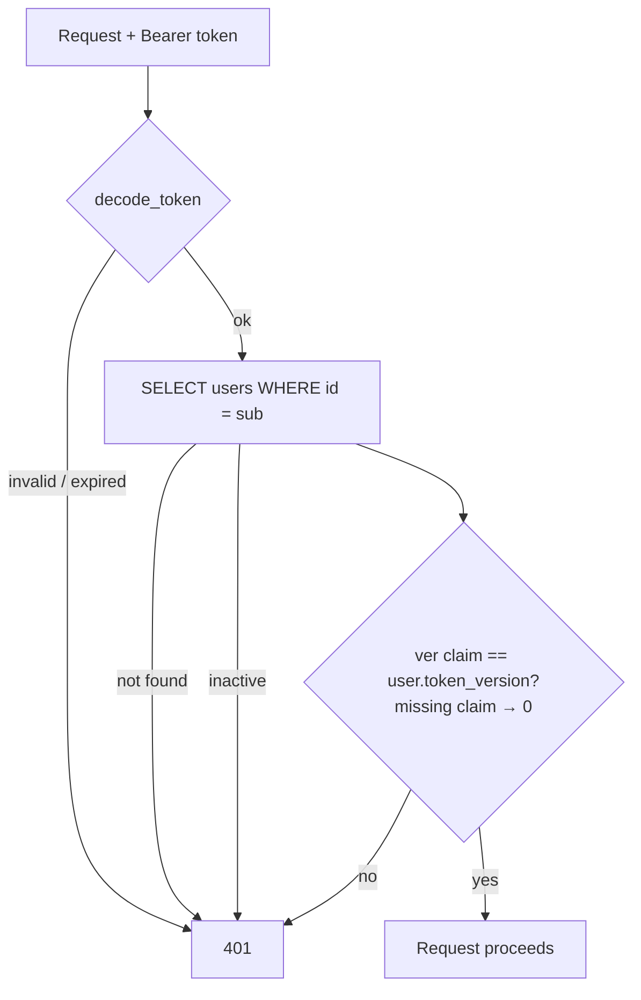
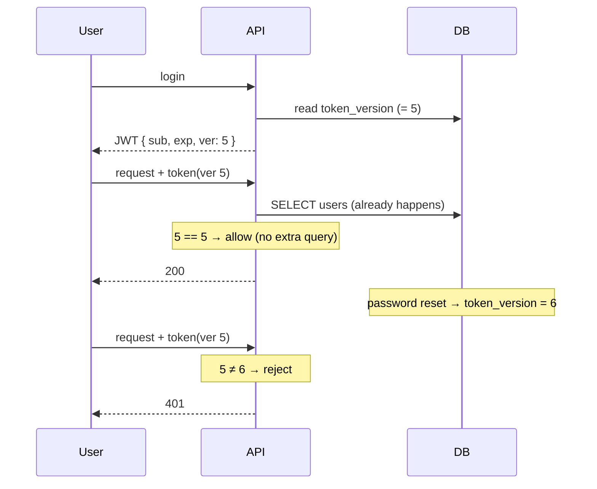
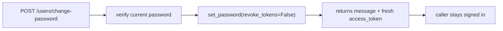
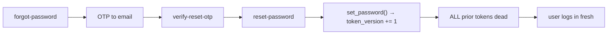
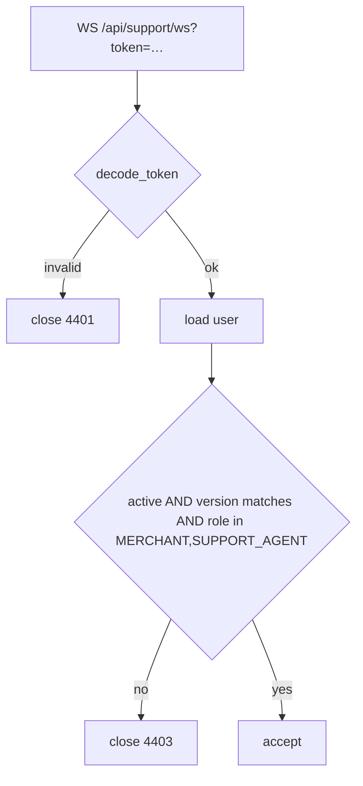

# SEC-002 — Deployment Package

**Change:** revocable access tokens via `users.token_version`
**Commits:** `f99d5dfe` (implementation) + `70bc06aa` (readiness fix)
**Status:** verified, awaiting deployment
**Recommendation:** ✅ **Ready for Production** — see §7

---

# 1. Executive Summary

## The problem

A Clari5Pay access token was valid until it expired and **could not be withdrawn**. For Admin and
Super Admin that meant **ten years** (`ADMIN_TOKEN_EXPIRE_DAYS = 3650`). Logout was a client-side
courtesy — the code says so at `auth.py:275`: *"stateless JWTs, so they are not server-side
revoked."*

A token leaked through a stolen laptop, a proxy log, browser history or XSS remained usable for a
decade. The only remedies were deactivating the account entirely, or rotating `SECRET_KEY`, which
signs out every user on the platform at once. **There was no way to revoke one compromised token.**

On a payments platform holding bank account numbers and KYC documents, that is the highest-impact
finding in the security review.

## Why this approach

Five options were evaluated in `AUTH_SESSION_ARCHITECTURE.md`. `token_version` was chosen because:

- **Zero runtime cost** — `users` is already loaded on every authenticated request, so the check is
  an integer comparison on data in hand. **Measured: 0 additional SQL statements.**
- **Backend-only** — no frontend change, which matters with manual deploys, no CI, and separately
  built frontends.
- **Backward compatible by construction** — old tokens keep working, so nobody is logged out.
- **Trivially revertible** at every stage.

**Notably rejected: enforcing `user_sessions`**, which was the original recommendation. Reading
`presence.py` showed `start_session` closes *all* prior sessions, so enforcing it would silently
turn single-session-per-user from cosmetic into a hard logout — an admin on laptop and phone
kicked out daily by a "security fix". It also makes authentication depend on writes that
deliberately fail silently.

**Refresh tokens (the textbook answer) were rejected** because they require backend and both
frontends to ship atomically — exactly what this pipeline cannot guarantee — and have the hardest
rollback.

## What changed

| Area | Change |
|---|---|
| Schema | `users.token_version INTEGER DEFAULT 0 NOT NULL` |
| Token | Session tokens carry a `ver` claim |
| HTTP auth | `get_current_user` rejects a version mismatch |
| WebSocket auth | Support chat performs the **same** check |
| Support login | Routed through `_issue_session_token` so its tokens are versioned |
| Password reset | Revokes all tokens for that user |
| Admin password reset | Revokes the target's tokens |
| New endpoint | `POST /api/auth/logout-all` |

## What did NOT change

- **Token lifetimes** — Admin/SA still 10 years. Shortening is a separate, announced change.
- **Frontend** — no change required or made.
- **API contracts** — two additive response fields, one new endpoint. Nothing removed or altered.
- **Self-service password change** — deliberately does *not* revoke (§2.4).
- **OTP and password-reset tokens** — purpose-scoped, short-lived, untouched.
- **`user.active` enforcement** — unchanged and still independent.
- **Login, OTP, and logout flows** — behaviourally identical.

---

# 2. Technical Documentation

## 2.1 Authentication architecture (updated)



Both authentication paths — `get_current_user` (`deps.py`) and the support WebSocket
(`support.py:165`) — run this identical sequence via the shared `token_version_matches` helper.
The WebSocket authenticates on its own code path, so a check applied only to `deps.py` would have
left it as a revocation bypass.

## 2.2 JWT lifecycle

| Token | Claims | Lifetime | Versioned |
|---|---|---|---|
| Session | `sub`, `exp`, **`ver`** | 10 y (Admin/SA) / 24 h | ✅ |
| Interim OTP | `sub`, `exp`, `purpose` | OTP+5 min | ❌ by design |
| Reset confirmation | `sub`, `exp`, `purpose` | 15 min | ❌ by design |

The two purpose-scoped tokens are validated by `_decode_purpose_token`, never reach
`get_current_user`, and are short-lived. Versioning them would add nothing.

## 2.3 `token_version` flow



## 2.4 Password change flow — self-service



**Deliberately does not revoke.** The frontend discards the returned `access_token`
(`api.ts` `changePassword`), so revoking would log the user out on their next request — a UX
regression, not a security gain, since they just proved knowledge of the current password. The
fresh token *is* returned, so enabling revocation later is a coordinated frontend change, not a
backend one. Applies equally to `PATCH /users/me`.

## 2.5 Password reset flow — revokes



**This is the case that matters most.** A reset is what someone does after suspecting compromise.
Without revocation an attacker holding a stolen token keeps access straight through it — at the
exact moment the user believes they have shut them out. The user is not holding a session token at
this point, so revoking costs nothing.

Admin-initiated resets (`users.py`, `support_management.py`) behave the same: the **target's**
sessions end, which is the intent.

## 2.6 Logout vs logout-all

| | `POST /auth/logout` | `POST /auth/logout-all` |
|---|---|---|
| Bumps version | ❌ | ✅ |
| Other devices | keep working | **signed out** |
| This device | keeps working¹ | stays in (fresh token) |
| Audit | `LOGOUT` | `LOGOUT_ALL` |

¹ Unchanged pre-existing behaviour — `/logout` is a client-side courtesy; the client discards its
own copy. `logout-all` is the genuine revocation control.

## 2.7 WebSocket authentication



Closes with the existing `4403` code, so client handling is unchanged.

**Known limitation:** an already-open socket is not re-validated, so it survives a revocation until
closed. Bounded by chat-session length. A periodic re-check is a documented follow-up.

---

# 3. Database Documentation

## 3.1 The column

```sql
users.token_version INTEGER DEFAULT 0 NOT NULL
```

Monotonically increasing revocation generation. Incrementing it invalidates every token previously
issued to that user.

## 3.2 Migration

Applied by `ensure_schema` (`db/migrate.py`) at startup:

```sql
ALTER TABLE users ADD COLUMN IF NOT EXISTS token_version INTEGER DEFAULT 0 NOT NULL;
```

Additive, idempotent, matches the repository's additive-only convention. Runs in `lifespan`
**before the app serves traffic**, with no exception handling — so a failed migration **aborts
startup** rather than serving against an inconsistent schema. Verified on demo: 35 users, all at
version 0.

## 3.3 Backward compatibility

| Case | Result |
|---|---|
| Old token (no `ver`) + migrated row (0) | ✅ accepted |
| Old token + bumped row | ✅ rejected (intended) |
| New token + old backend | ✅ accepted (unknown claim ignored) |
| NULL column | ✅ read as 0 — an incomplete migration cannot lock anyone out |

**No user is logged out by this deployment.**

## 3.4 Rollback

```bash
ssh prod 'cd ~/Clari5Pay_Platform && git revert 70bc06aa f99d5dfe && ./deploy_safe.sh'
```

**Leave the column.** It is inert without the code, and dropping it is irreversible. Versioned
tokens continue to validate against the reverted build, which ignores the unknown claim.

---

# 4. Deployment Guide

## 4.1 Steps

```bash
# 1. Cherry-pick onto the production branch (prod deploys `production`, not `main`)
git checkout -B prod-sec002 origin/production
git cherry-pick f99d5dfe 70bc06aa
git push origin prod-sec002:production

# 2. Deploy
ssh prod 'cd ~/Clari5Pay_Platform && git pull --ff-only origin production && ./deploy_safe.sh'
```

The migration runs automatically at startup.

## 4.2 Verification checklist

- [ ] Deploy exits 0, no `BUILD FAILED`
- [ ] All 8 containers up
- [ ] **Column exists; every row at 0**
- [ ] Zero startup errors / tracebacks

## 4.3 Smoke tests

- [ ] Fresh login succeeds; token contains `ver`
- [ ] **A token captured *before* deploy still works** ← the backward-compatibility guarantee
- [ ] Support-agent login succeeds (separate issuance path)
- [ ] **Support chat WebSocket connects**
- [ ] OTP flow unaffected
- [ ] Password reset works, and old tokens stop working after it
- [ ] **Self-service password change does NOT log you out**
- [ ] Admin/SA/Merchant portals all load

## 4.4 Monitoring

| Metric | Expected | Action if not |
|---|---|---|
| **401 rate** | **flat** | spike → grandfathering broken → rollback |
| 5xx rate | 0 | investigate |
| Startup errors | 0 | migration failed → check logs |
| Login success | unchanged | investigate |

**False positives:** natural 24 h token expiry during the window; deactivated accounts;
pre-existing unauthenticated probes.

## 4.5 Rollback

Trigger on: sustained 401 spike, login failures, or WebSocket rejections. Procedure in §3.4.
Post-rollback: confirm 401 rate returns to baseline and logins succeed.

---

# 5. Security Documentation

`SECURITY_REVIEW.md` is updated separately in this change: SEC-002 marked **RESOLVED**, with
deferred items (`ADMIN_TOKEN_EXPIRE_DAYS`, per-device `sid`, self-service revocation) recorded as
follow-ups rather than open findings.

---

# 6. Final Verification — all evidence

| Check | Method | Result |
|---|---|---|
| **All tests pass** | full suite, committed code | ✅ **55 passed** |
| Tests detect the defect | run against unfixed code | ✅ 3 rejection tests fail without it |
| **No API contract broken** | source inspection | ✅ 2 additive fields, 1 new endpoint |
| **No additional queries** | SQLAlchemy event listener | ✅ **0 statements** for the version check |
| **Frontend unchanged** | traced `api.ts` consumers | ✅ no change required |
| **WebSocket protected** | `inspect.getsource` assertion | ✅ verified in test + code |
| Self-service does not revoke | source assertion | ✅ both paths |
| Reset does revoke | source assertion | ✅ no opt-out |
| Support login versioned | source assertion | ✅ |
| Migration on real DB | demo | ✅ 35 users at 0 |
| End-to-end revocation | live demo DB | ✅ legacy valid → bump → rejected |

---

# 7. Final Recommendation

## ✅ **READY FOR PRODUCTION**

The change is small, measured, backward compatible, backend-only, and revertible. It was verified
against a real database, and its tests were validated against the unfixed code to prove they
detect the defect rather than passing vacuously.

Two defects were found by reviewing my own work rather than by testing alone — the WebSocket
bypass, and the self-service logout regression. Both are fixed and covered.

## Remaining risks

| Risk | Severity | Notes |
|---|---|---|
| **Grandfathered tokens** | **Medium** | Existing tokens stay valid until that user's version is first bumped. **A currently-stolen admin token is not killed by this deploy.** Closing it needs the scheduled `UPDATE users SET token_version = token_version + 1` — one forced logout. |
| Admin lifetime still 10 y | Medium | Stage 4, separate and announced. Revocability is now available; duration is not yet reduced. |
| WebSocket revocation lag | Low | Open sockets survive until closed. |
| Increment race | Low | Concurrent bumps can collapse a generation. Security outcome unaffected. |
| No per-device revocation | Low | Deliberately out of scope. |

## Recommended follow-ups, in order

1. **Schedule the version bump** to retire grandfathered tokens — this is what fully closes SEC-002.
2. **Reduce `ADMIN_TOKEN_EXPIRE_DAYS`** 3650 → 7–30, announced.
3. **Wire `logout-all` into the UI** — the control exists but nothing calls it.
4. Frontend stores the returned token, then enable self-service revocation.
5. Atomic SQL increment.
6. Periodic WebSocket re-validation, or `sid` binding.

**SEC-002 is fixed for every token issued from this deploy onward. Item 1 is what closes it for
tokens issued before it.**
